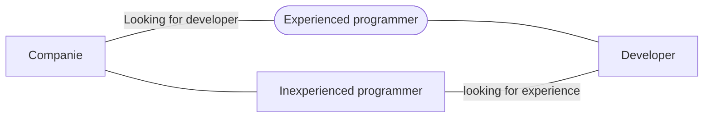

# Firebase Bank app

A project where i could use Google Firebase to do a basic simulation of a bank, where i practiced Authentication and Firestore to do **'pix transfer'** which consists of transferring money from one user to another fast and free.

## Technologies i've used

 - **MVVM** - Architecture choosed;
 - **Fragment** - To avoid using only Activities;
 - **Navigation** - To set navigation between my Fragments;
 -  	Firebase {
 - **Authentication** - To register and login my user on the app;
 - **Firestore** - Database where i can save my user information like name, last name, money balance and more;
 -     }
 - **RecyclerView** - To list my data on UI;
 - **ViewBinding** - To get access to my View elements with less polution ( to not use FindViewById );

# APP Screenshot/Videos

  

  

  

  

## Diagram about companies

> Situation of companies today.

